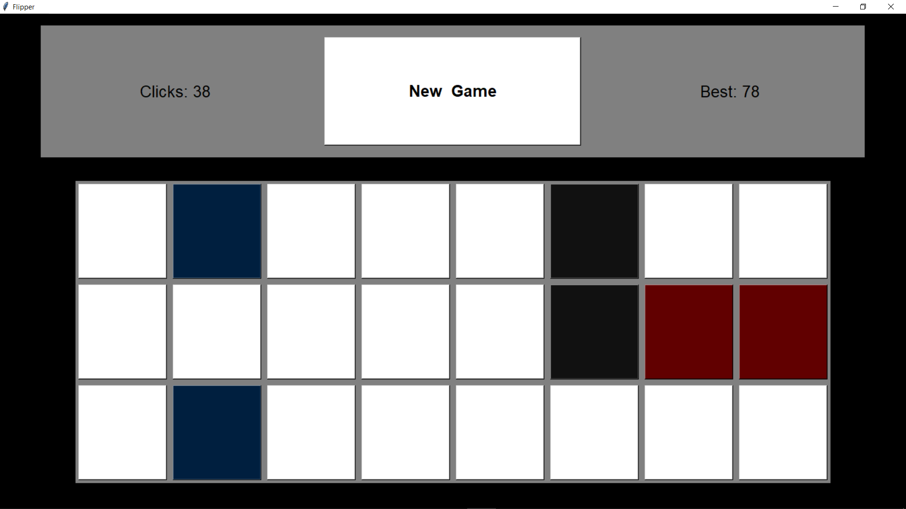

# Flipper

A digital version of the classic card flipping memory game made purely using Tkinter.

- The Top left corner shows the current number of clicks and the top right corner shows the minimum number of clicks in whch the game was completed. 
- The middle button is to start a new game and can be called anytime during or after the game is completed. 
- The tiles are arranged in a random order for every new game
- Once, a matching pair of tiles is found, they are unclickable.
- If two tiles are clicked such that they are not matching, the uncovered tile will flip back and the player has to remember it's loaction.
- The goal is to uncover all the tiles in the minimum number of clicks.

1. The initial view of the game

2. When the game starts and similar tiles have been uncovered

3. When all the matching tiles are found

